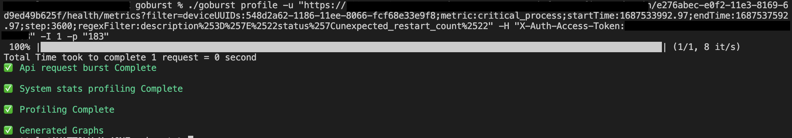
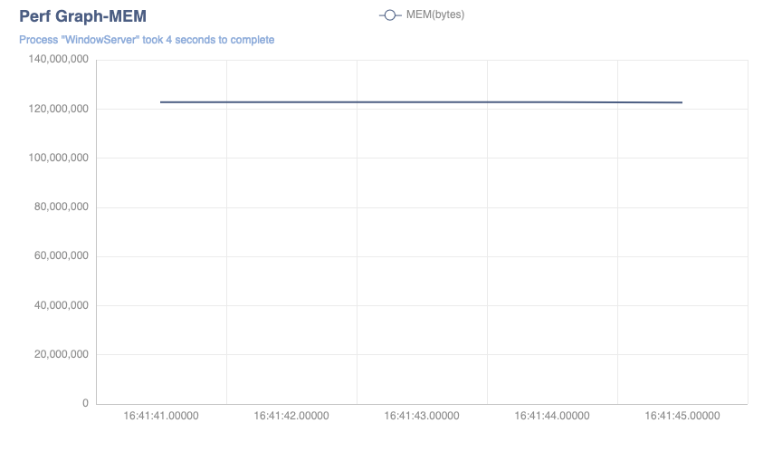

# Go Burst

Command Line interface to profile processes while sending Api requests .

This can help show the amount of CPU and Memory utilization of multiple processes while sendind API traffic . It can help understand how scalable the api endpoint is and how much resource utilization it will incurr when there is a lot of traffic . 

Though the project is mainly aimed for profiling , it can also be used to simply send a lot of requests to a server . 

## Installation

1. Install Go
2. Clone the repository:

   ```shell
   git clone https://github.com/akashdev99/goburst.git
   ```

3. Change to the project directory:

   ```shell
   cd goburst
   ```

4. Build the tool:

   ```shell
   go build .
   ```

5. Add the tool to your PATH (optional):

   ```shell
   export PATH=$PATH:/path/to/goburst
   ```

## Usage

The tool sends N number of requests to the server while profiling the process Ids specified via command flags . If no process ID is set , then no profiling will be done .

```shell
# Command 1
goburst profile [flags]

profile command  allows to send "n" Number of requests , profile specified proces IDs and generate Graphs for CPU and Memory (currently supported)

Flags:
  -H, --header strings   List of headers to be added
  -h, --help             help for profile
  -i, --interval int     Interval at which the profiling is done (milliseconds) (default 1000)
  -I, --iteration int    Number of times the endpoint requests will be sent (default 1)
  -M, --method string    Http Method (default "GET")
  -n, --name string      Title for the graphs generated (default "Perf Graph")
  -p, --pidlist ints     List of processes to profile
  -u, --url string       Add API endpoint to be profiled
  -v, --visualize        Save the data captured in a line graph (default true)

Examples:

- Example 1: 
goburst profile -u "xyz.com" -H "X-Auth-Access-Token:abcd" -I 1 -p "183" --visualize=false

# Command 2
toolname version

Returns current version of the tool

Examples:
- Example 1:
goburst version
```

## Output:
-Succesfull Profiling & Visualization



-Failure Scenario


Example of generated graphs/visualization:




## Configuration

The binary is platform specific . Hence it needs to be built on the that OS type itself to be compatible . 
